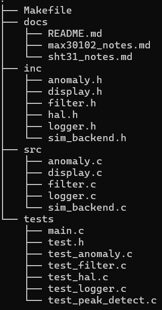

# vitals-monitor

A portable vital signs monitor simulator in C.

Clean HAL design. Realistic sensor simulation. Signal processing. CSV logging. ANSI dashboard.

 

## Status

Core pipeline complete and tested: HAL, simulator, filter, 
peak detection, anomaly detection, logger.

In progress: display, CLI parsing, scenario injection, signal handling, hal_design doc.

 

## Overview

vitals-monitor is an embedded-style monitoring project written in C (C99). It simulates a portable device that acquires, processes, displays, and logs vital-sign data from two sensor models:

- MAX30102 — optical heart-rate / SpO2 sensor
- SHT31 — temperature / humidity sensor

The project is built around a Hardware Abstraction Layer (HAL) so that the simulator backend can later be replaced by a real hardware backend with minimal changes to the rest of the code.

This means the simulation is only the data source. The rest of the system is designed like a real embedded application:

simulate -> acquire -> filter -> detect -> log -> display

 

## Why this project exists

The goal of vitals-monitor is not just to generate numbers. It is to practice and demonstrate the kind of engineering thinking expected in embedded systems:

- separating hardware access from application logic
- designing around interfaces
- handling noisy signals
- validating anomaly detection
- writing unambiguous logs
- dealing with failures such as sensor disconnection
- building software that could later run against real devices

It is a software-first project, but its architecture is intended to be realistic and portable.

 

## Goals

This project aims to:

- design and implement a portable HAL
- simulate physiologically plausible sensor behaviour
- implement a complete data pipeline in C
- practice filtering and peak detection on noisy data
- detect clinically relevant anomalies
- log readings in a standard machine-readable format
- document the architecture as if another engineer had to plug in real hardware tomorrow

 

## Features

Core features:

- Simulates two I2C sensor devices:
  - MAX30102 for heart-rate / SpO2 waveform data
  - SHT31 for temperature and humidity
- Uses a HAL interface to isolate hardware-specific logic
- Polls sensors at a configurable interval
- Implements a moving average filter to smooth noisy signals
- Implements peak detection to derive BPM from the simulated PPG waveform
- Detects anomalies such as:
  - bradycardia
  - tachycardia
  - hypoxia
  - fever
- Logs all readings to a CSV file
- Uses ISO 8601 UTC timestamps
- Displays a live dashboard in the terminal using ANSI escape codes
- Supports reproducible anomaly injection through a scenario file
- Supports simulated device disconnection and reconnection through POSIX signals

Design features:

- Portable C99 code
- No hardware required
- No external UI libraries
- No signal-processing libraries
- Configurable simulation parameters
- Clear separation between acquisition, filtering, anomaly detection, logging, display, and scenario injection

 

## Concepts

### I2C Devices

An I2C device is a hardware component that communicates using the Inter-Integrated Circuit (I2C) protocol, a widely used serial communication standard in embedded systems. I2C uses only two shared lines: SCL (Serial Clock) and SDA (Serial Data), which allows multiple devices to communicate over the same bus.

In an I2C system, one device typically acts as the master, controlling the clock and starting communication, while the others act as slave devices, responding when addressed. Each I2C device has a unique address, which allows the master to select and exchange data with a specific peripheral.

I2C devices are commonly used for components such as temperature sensors, pulse oximeters, memory chips, displays, and real-time clocks. Their main advantage is that they reduce wiring complexity while allowing several peripherals to be connected to the same microcontroller.

### Hardware Abstraction Layer (HAL)

A Hardware Abstraction Layer (HAL) is a software layer that separates application logic from direct hardware access. Instead of manipulating peripheral registers or device-specific details in the main program, developers interact with a higher-level API that provides standardized functions for hardware operations.

The purpose of a HAL is to make embedded software more portable, readable, and easier to maintain. By isolating hardware-specific implementation details, the same application logic can be reused across different boards or microcontroller families with fewer code changes.

In practice, a HAL typically provides interfaces for common peripherals such as GPIO, UART, I2C, SPI, timers, and ADC modules. This approach reduces complexity in the application layer and supports a cleaner software architecture.

In vitals-monitor, the HAL is what makes the project portable: the simulator backend and a future real-hardware backend both implement the same interface.

### ISO 8601

ISO 8601 is an international standard for representing dates and times as strings. It looks like this:

2026-03-25T14:32:01.123Z

The T separates date from time. The Z means UTC, so there is no timezone ambiguity. The format is fixed-width and lexicographically sortable, which means alphabetical sorting also preserves chronological order. That makes it ideal for programmatic log parsing.

In medical and embedded contexts, timestamp ambiguity is a safety issue. A format like 03/04/26 14:32 may mean March 4th or April 3rd depending on locale. ISO 8601 removes that ambiguity.

For this reason, vitals-monitor writes timestamps in UTC ISO 8601 format in its CSV logs.

 

## Project Structure

Important documentation files:

- docs/max30102_notes.md
  Notes taken from the MAX30102 datasheet and register map analysis.

- docs/sht31_notes.md
  Notes taken from the SHT31 datasheet, command set, and measurement behaviour.

- docs/hal_design.md
  Explains the HAL architecture, design decisions, and how a real hardware backend could replace the simulator.

 

## Build Instructions

Requirements:

- Linux
- gcc
- make
- standard C library
- POSIX support
- math.h

Build the program:

make

This should generate the vitals-monitor executable.

Clean object files:

make clean

Remove generated files and binaries:

make fclean

Rebuild from scratch:

make re

 

## Run Instructions

Basic execution:

./vitals-monitor

Available CLI options:

./vitals-monitor [--log <file>] [--interval <ms>] [--window <n>] [--no-display] [--scenario <file>]

Examples:

Run with default settings:

./vitals-monitor

Write logs to a custom file:

./vitals-monitor --log vitals.csv

Poll sensors every 250 ms:

./vitals-monitor --interval 250

Use a moving-average window of 8 samples:

./vitals-monitor --window 8

Disable terminal display and only log data:

./vitals-monitor --no-display

Run a reproducible scenario:

./vitals-monitor --scenario scenarios/example.scn

Combine options:

./vitals-monitor --log logs/run.csv --interval 500 --window 5 --scenario scenarios/example.scn

 

## Scenario Files

Scenario files allow deterministic testing of anomalies and state changes.

Example:

0       normal
15000   bradycardia
30000   normal
45000   hypoxia
60000   normal

Each line describes:
- a time offset in milliseconds from program start
- the simulated physiological state to apply

This allows the anomaly detection system to be tested and demonstrated in a predictable way.

Typical use cases:
- verifying that bradycardia alerts trigger correctly
- checking whether hypoxia is logged at the correct time
- validating the CSV output
- making evaluation runs reproducible

 

## Signals

The program supports simulated sensor connection changes through POSIX signals.

Disconnect MAX30102:

kill -USR1 <pid>

This simulates a disconnection of the MAX30102 sensor.

Reconnect MAX30102:

kill -USR2 <pid>

This restores the simulated connection.

This behaviour is useful for testing robustness and error handling without crashing or stopping the rest of the system.

To find the program PID, you can use:

ps aux | grep vitals-monitor

 

## Logging

All readings are logged to CSV with ISO 8601 timestamps.

Example log line:

2026-03-25T14:32:01.123Z,MAX30102,97.800,percent,NORMAL

Depending on implementation, fields may include:
- timestamp
- sensor identifier
- value
- unit
- anomaly classification

The logging format is intentionally simple so the output can be used easily with:
- spreadsheets
- shell tools
- C parsers
- Python notebooks
- plotting tools like gnuplot

 

## Resources

Datasheets and hardware references:

- MAX30102 Datasheet:
  https://datasheets.maximintegrated.com/en/ds/MAX30102.pdf

- SHT31 Datasheet:
  https://sensirion.com/resource/datasheet/sht3x

- I2C Protocol Primer:
  https://www.i2c-bus.org/

Signal and embedded-system references:

- Photoplethysmogram Overview:
  https://en.wikipedia.org/wiki/Photoplethysmogram

- ANSI Escape Codes Reference:
  https://en.wikipedia.org/wiki/ANSI_escape_code

- A Practical Introduction to HALs:
  https://interrupt.memfault.com/blog/hardware-abstraction-layer

- WiringPi:
  http://wiringpi.com/

Project-specific documents:

- docs/max30102_notes.md
- docs/sht31_notes.md
- docs/hal_design.md

These notes document the register maps, sensor behaviour, and design decisions used in the simulator and HAL.

 

## Notes

This project is intentionally built as a software-first embedded system: the simulator is only the hardware source. The architecture around it is meant to resemble a real embedded application.

That makes vitals-monitor useful not only as a C project, but also as a demonstration of:
- embedded design thinking
- hardware/software separation
- robustness under failure
- reproducible system testing

 

## Author

vitals-monitor was developed as a learning project in embedded-style C programming, focused on medical sensor simulation, HAL design, and robust system architecture.